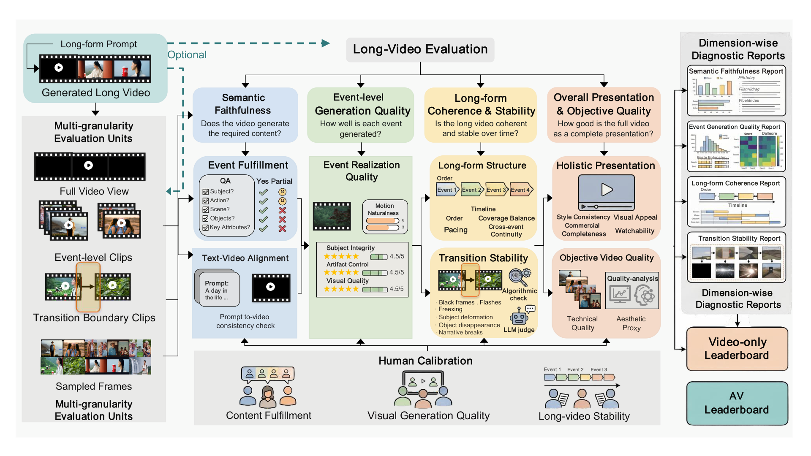

# LongAV-Compass: Towards Unified Evaluation of Minute-Scale Audio-Visual Generation Across T2AV, I2AV, and V2AV

<p align="center">
  <a href="https://arxiv.org/abs/2605.26244"></a>
  <a href="https://huggingface.co/papers/2605.26244"></a>
  <a href="https://huggingface.co/datasets/TengfeiLiuCoder/LongAV-Compass"></a>
  
  
</p>

<p align="center">
  <a href="https://arxiv.org/abs/2605.26244">Paper</a> |
  <a href="https://huggingface.co/datasets/TengfeiLiuCoder/LongAV-Compass">Dataset</a> |
  <a href="docs/dataset_format.md">Data Format</a> |
  <a href="docs/score_definition.md">Score Definition</a> |
  <a href="docs/troubleshooting.md">Troubleshooting</a>
</p>

LongAV-Compass is a benchmark and evaluation toolkit for minute-scale audio-visual generation. It covers text-to-audio-video (T2AV), image-to-audio-video (I2AV), and video-to-audio-video (V2AV), and evaluates long videos through event-level QA, generation quality, long-form structure, transition stability, holistic presentation, text-video alignment, reference consistency, and optional audio diagnostics.

This repository provides the public evaluation code, sample preparation tools, shell entry points, and paper-facing score aggregation scripts. Benchmark data is hosted on Hugging Face; generated model videos, cache files, and private credentials should stay outside the Git repository.

<p align="center">
  
</p>

## News

- `2026/05` LongAV-Compass paper is available on arXiv.
- `2026/05` LongAV-Compass dataset is available on Hugging Face.
- `2026/05` Public evaluation code and scripts are released.

## Benchmark Overview

| Task | Input Condition | Target Output | Main Evaluation Focus |
| --- | --- | --- | --- |
| T2AV | Long-form text prompt | Minute-scale audio-video | Event fulfillment, visual quality, long-range structure, audio-video consistency |
| I2AV | Reference image + prompt | Minute-scale audio-video | Image anchoring, identity/reference consistency, event quality, temporal stability |
| V2AV | Reference video + prompt | Continued audio-video | Video continuation, transition stability, long-form coherence, semantic faithfulness |

LongAV-Compass contains 284 curated test cases across T2AV, I2AV, and V2AV. The evaluator builds multi-granularity units from each generated long video, including full-video views, event-level clips, transition-boundary clips, and sampled frames.

## Contents

- [Quick Start](#quick-start)
- [Prepare Your Generated Videos](#prepare-your-generated-videos)
- [Run Evaluation](#run-evaluation)
- [Outputs](#outputs)
- [Score Policy](#score-policy)
- [Dataset Layout](#dataset-layout)
- [Repository Layout](#repository-layout)
- [Citation](#citation)

## Quick Start

```bash
git clone https://github.com/pkucs-Ltf/LongAV-Compass.git
cd LongAV-Compass

conda env create -f environment.yaml
conda activate longav_compass

bash setup_longav.sh
```

`setup_longav.sh` installs the package, initializes the CLIP backend, and creates `configs/api_keys.yaml` from the example template if it does not already exist. The default CLIP path uses a multilingual OpenCLIP model and can be overridden with `LONGAV_CLIP_BACKEND`, `LONGAV_CLIP_MODEL`, and `LONGAV_CLIP_PRETRAINED`.

Download the benchmark dataset:

```bash
huggingface-cli download TengfeiLiuCoder/LongAV-Compass \
  --repo-type dataset \
  --local-dir data/LongAV-Compass
```

Fill local credentials before running judge-based evaluation:

```bash
# Edit configs/api_keys.yaml with your local API credentials.
```

## Prepare Your Generated Videos

Place model outputs under `outputs/`. The model directory name should include the task name (`t2av`, `i2av`, or `v2av`) so the preparation script can infer the task.

```text
outputs/
  MyModel_v2av_run/
    advertising/
      V2AV_001/
        full_video.mp4
```

Build prepared samples from the Hugging Face dataset layout:

```bash
PYTHONPATH=src python -m longav_eval prepare-event-testset \
  --source-root data/LongAV-Compass \
  --output-root outputs \
  --test-root samples/prepared \
  --sample V2AV_001
```

You can repeat `--sample` to prepare multiple examples, for instance `--sample T2AV_001 --sample I2AV_001 --sample V2AV_001`.

## Run Evaluation

Run a prepared-sample batch:

```bash
LONGAV_QA_ROOT=data/LongAV-Compass \
bash run_eval_batch.sh samples/prepared runs/example_eval '*__*'
```

Evaluate selected models only:

```bash
LONGAV_MODEL_NAMES="Kling Seedance2 Veo" \
LONGAV_MAX_WORKERS=8 \
LONGAV_QA_ROOT=data/LongAV-Compass \
bash run_eval_batch.sh samples/prepared runs/selected_models 'v2av__*'
```

Resume a previous run and compute missing entries only:

```bash
LONGAV_REUSE_ROOT=runs/previous_eval \
LONGAV_ONLY_MISSING=1 \
LONGAV_QA_ROOT=data/LongAV-Compass \
bash run_eval_batch.sh samples/prepared runs/resume_eval '*__*'
```

Run paper-facing balanced-score aggregation from a wide metric table:

```bash
bash run_compute_scores.sh /path/to/best_sample_model_metrics_wide.csv runs/paper
```

## Outputs

Batch evaluation writes one directory per sample plus batch-level summaries:

```text
runs/example_eval/
  batch_status.json
  all_model_scores.csv
  <sample_id>/
    event_eval_summary.json
    model_scores.csv
    event_fulfillment_scores.csv
    event_realization_scores.csv
    longform_scores.csv
    transition_scores.csv
    holistic_scores.csv
    text_video_alignment.csv
    <model_name>/
      model_summary.json
```

Balanced-score aggregation writes:

```text
runs/paper/
  balanced_sample_model_scores.csv
  scenario_balanced_scores.csv
```

## Score Policy

Paper-facing aggregate analyses use `balanced_score`: six shared video metrics are normalized to a 0-100 scale and averaged with equal weight. Human alignment is reported through dimension-wise pairwise win-rate comparisons rather than a single total score.

See [docs/score_definition.md](docs/score_definition.md) for metric definitions and aggregation details.

## Dataset Layout

The Hugging Face dataset follows this structure:

```text
LongAV-Compass/
  T2AV/final_json/T2AV_001.json
  I2AV/final_json/I2AV_001.json
  I2AV/images/I2AV_001.jpg
  V2AV/final_json/V2AV_001.json
  V2AV/videos/V2AV_001.mp4
```

Prepared samples follow this structure:

```text
samples/prepared/<sample_id>/
  sample_index.json
  canonical_events.json
  event_checklists.json
  <model_name>/
    full_video.mp4
    events/
      event_001.mp4
    boundaries/
      boundary_001.mp4
```

See [docs/dataset_format.md](docs/dataset_format.md) for the complete schema.

## Repository Layout

```text
src/longav_eval/        Python package and CLI implementation
scripts/                Shell wrappers for setup, batch evaluation, and scoring
configs/                Evaluation profiles and API key template
examples/               Minimal prepared-sample templates
docs/                   Data format, score definition, reproduction, troubleshooting
```

## Troubleshooting

Start with [docs/troubleshooting.md](docs/troubleshooting.md). Most issues are caused by missing `ffmpeg`, unset API credentials, an invalid prepared-sample layout, or using fixed QA files without `LONGAV_QA_ROOT`.

## Citation

```bibtex
@misc{liu2026longavcompass,
  title={LongAV-Compass: Towards Unified Evaluation of Minute-Scale Audio-Visual Generation Across T2AV, I2AV, and V2AV},
  author={Tengfei Liu and Yang Shi and Xuanyu Zhu and Jiafu Tang and Liu Yang and Qixun Wang and Zhuoran Zhang and Yuqi Tang and Fengxiang Wang and Yuhao Dong and Xinlong Chen and Bozhou Li and Bohan Zeng and Yue Ding and Xiaohan Zhang and Jialu Chen and Haotian Wang and Yuanxing Zhang and Pengfei Wan and Leye Wang},
  year={2026},
  eprint={2605.26244},
  archivePrefix={arXiv},
  primaryClass={cs.CV},
  url={https://arxiv.org/abs/2605.26244}
}
```
